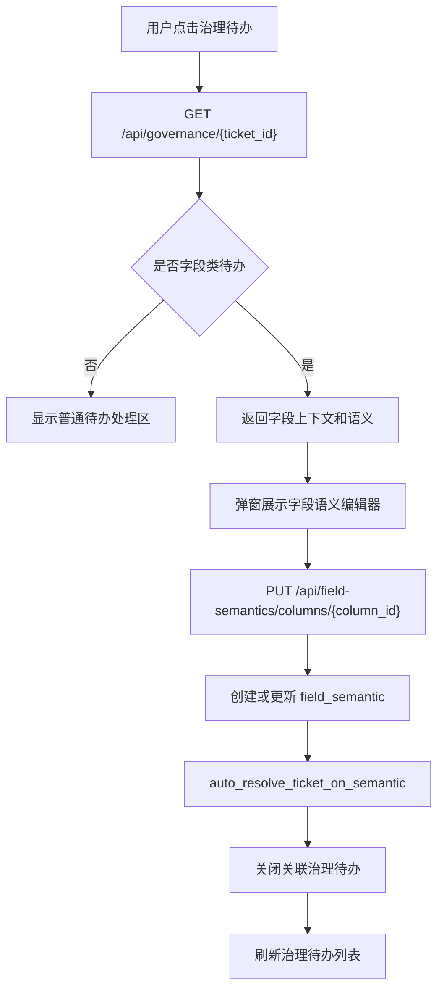

# 字段语义治理编辑器设计

## 目标

打通治理待办和字段语义维护的首版闭环：用户从“字段语义缺失”类治理待办进入处理弹窗，查看字段上下文，补充业务别名、字段含义、枚举解释和质量说明，保存后系统自动写入字段语义并关闭关联治理待办。

## 背景

当前 MetricForge 已具备以下基础：

- 元数据采集会写入 `table_metadata`、`column_metadata`、`index_metadata`、`constraint_metadata`。
- 采集后会检测缺少语义的字段，并创建 `related_object_type="column"`、`related_object_id=<column_id>` 的治理待办。
- 治理待办页面已有详情弹窗、负责人分配、状态流转和解决说明。
- `field_semantic` 模型已经存在，但缺少面向 Web 的保存接口和治理待办联动入口。

本设计聚焦首版可用闭环，不建设完整字段语义工作台。

## 范围

本轮覆盖：

- 治理待办详情 API 返回字段类待办的字段上下文。
- 新增字段语义 API，支持按字段读取和保存语义。
- 治理待办详情弹窗在字段类待办中展示字段语义编辑器。
- 保存字段语义后自动关闭该字段关联的 open / in_progress 待办。
- 字段语义列表展示字段完整路径和治理状态，便于确认治理结果。
- 增加自动化测试覆盖 API 和 Web UI 闭环。

本轮不覆盖：

- 批量字段治理。
- 字段语义版本历史。
- 审批流。
- AI 自动生成字段语义。
- 复杂 JSON 枚举编辑器。
- 字段画像采集增强。
- 权限和多用户审计。

## 推荐方案

采用“治理待办详情弹窗内嵌字段语义编辑器”的方式。

原因：

- 当前用户最自然的工作入口是治理待办，而不是字段列表。
- 字段语义缺失待办已经带有 `related_object_id`，可以直接定位字段。
- 不需要引入新前端框架，也不需要增加复杂页面跳转。
- 保存语义和关闭待办可以在一次操作中完成，闭环清晰。

## 用户流程

1. 用户进入“治理待办”页面。
2. 点击一条字段语义缺失待办。
3. 弹窗展示待办详情和字段上下文：
   - schema
   - 表名
   - 字段名
   - 字段类型
   - 注释
   - 是否可空
   - 主键 / 外键标识
   - 采集到的枚举样例
4. 弹窗展示字段语义表单：
   - 业务别名
   - 字段含义
   - 单位
   - 枚举值解释
   - 数据质量说明
   - 治理负责人
5. 用户点击“保存语义并关闭待办”。
6. 系统创建或更新 `field_semantic`。
7. 系统将该字段关联的 open / in_progress 治理待办更新为 resolved。
8. 页面刷新，治理待办列表不再显示该 open 待办；字段语义列表可看到治理结果。

## API 设计

### 获取字段语义

新增：

`GET /api/field-semantics/columns/{column_id}`

返回字段上下文和已存在语义。

成功响应：

```json
{
  "column": {
    "id": 1,
    "schema_name": "DWD",
    "table_name": "CONTRACT",
    "column_name": "STATUS",
    "column_type": "VARCHAR2(20)",
    "nullable": true,
    "comment": "状态",
    "is_primary_key": false,
    "is_foreign_key": false,
    "enum_samples": "A,I"
  },
  "semantic": {
    "id": 10,
    "business_alias": "合同状态",
    "meaning": "表示合同当前生命周期状态",
    "unit": null,
    "enum_values": "{\"A\":\"有效\",\"I\":\"无效\"}",
    "data_quality_note": "历史数据存在空值",
    "is_governed": true,
    "governed_by": "Codex",
    "governed_at": "2026-06-18 10:00:00"
  }
}
```

字段不存在时返回 404。

### 保存字段语义

新增：

`PUT /api/field-semantics/columns/{column_id}`

使用 query 参数保存，保持与现有 API 风格一致：

- `business_alias`
- `meaning`
- `unit`
- `enum_values`
- `data_quality_note`
- `governed_by`

保存规则：

- `business_alias` 和 `meaning` 必填。
- `enum_values` 以文本保存，不在本轮强制 JSON 校验。
- 如果字段已有语义，则更新已有记录。
- 如果字段没有语义，则创建新记录。
- 保存后设置：
  - `is_governed = true`
  - `governed_by = governed_by`
  - `governed_at = 当前时间`
- 保存成功后调用现有 `auto_resolve_ticket_on_semantic(column_id, governed_by)` 自动关闭关联待办。

成功响应：

```json
{
  "message": "字段语义已保存",
  "semantic_id": 10,
  "closed_tickets": true
}
```

## Web 设计

### 治理待办弹窗

保留现有待办处理区，并新增字段语义区域。

仅当待办满足以下条件时显示：

- `related_object_type == "column"`
- 后端返回 `field_context`

新增 DOM 约定：

- `id="fieldSemanticPanel"`
- `id="semanticBusinessAlias"`
- `id="semanticMeaning"`
- `id="semanticUnit"`
- `id="semanticEnumValues"`
- `id="semanticQualityNote"`
- `id="semanticGovernedBy"`
- `id="saveFieldSemantic"`
- `id="fieldSemanticResult"`

保存按钮文案：

`保存语义并关闭待办`

保存成功后：

- 显示成功反馈。
- 刷新当前治理待办列表。
- 保留当前 URL 查询参数，例如 `?status=open`。

普通非字段待办不显示字段语义编辑器，只保留现有负责人和状态处理能力。

### 字段语义列表

字段语义列表增加字段上下文展示：

- `schema.table.column`
- 字段类型
- 业务别名
- 字段含义摘要
- 治理状态
- 治理负责人

空状态保持现有提示。

## 数据流



## 错误处理

- 字段不存在：API 返回 404，弹窗显示“关联字段不存在或已被删除”。
- 必填项缺失：API 返回 400，页面显示具体错误。
- 保存失败：页面保留用户输入并显示错误。
- 自动关闭待办失败：保存语义失败并回滚，避免出现语义已治理但待办仍打开的不一致状态。
- 非字段类待办：不请求字段语义 API，不显示编辑器。

## 测试策略

新增自动化测试：

- API 保存字段语义时创建 `field_semantic`。
- API 保存字段语义时更新已有 `field_semantic`。
- API 保存字段语义后自动关闭字段关联治理待办。
- 治理待办详情 API 对字段类待办返回字段上下文。
- 治理待办页面包含字段语义编辑器控件。
- 字段语义列表展示 `schema.table.column` 和治理状态。

保留现有全量测试作为回归验证。

## 验收标准

- 用户可以从字段类治理待办打开字段语义编辑器。
- 用户可以补充业务别名、含义、单位、枚举解释和质量说明。
- 保存后字段语义记录被创建或更新。
- 保存后对应 open / in_progress 治理待办自动变为 resolved。
- 字段语义列表能看到治理后的字段。
- 非字段类待办不受影响。
- 全量测试通过。
