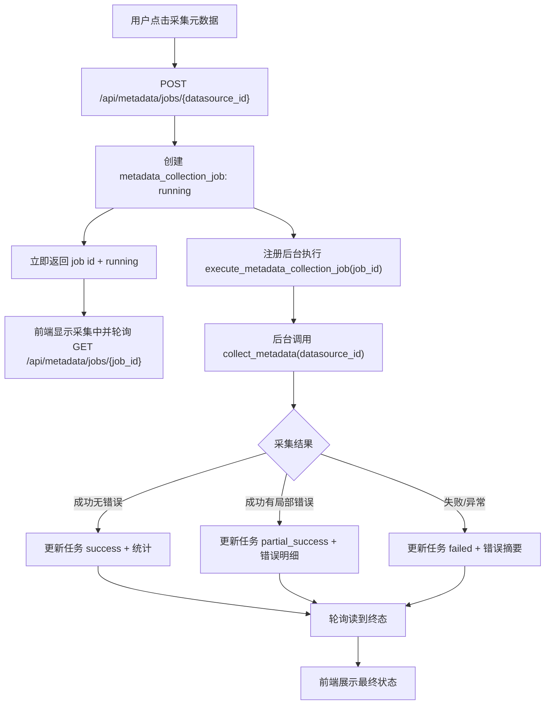

# 元数据采集异步执行与安全硬化设计

## 目标

把当前元数据采集任务中心从“同步等待采集完成”升级为“创建任务后后台执行、前端轮询状态”，同时修复数据源详情页把后端错误文本直接拼接进 `innerHTML` 的安全隐患。

这一阶段的重点是轻量异步闭环：用户点击采集后立即得到任务 ID，页面显示采集中并轮询任务详情；后台执行完成后，任务状态、统计和错误信息继续落库并被任务中心复用。

## 背景

当前 MetricForge 已具备：

- `MetadataCollectionJob` 模型记录采集任务状态、统计、耗时和错误。
- `metadata_job_service.run_metadata_collection_job()` 可以创建任务并同步执行采集。
- `POST /api/metadata/jobs/{datasource_id}` 会同步创建并执行任务。
- `GET /api/metadata/jobs` 和 `GET /api/metadata/jobs/{job_id}` 可查询任务。
- 数据源详情页展示最近采集历史，并能进入采集任务中心和任务详情页。
- 旧接口 `POST /api/metadata/collect/{datasource_id}` 仍兼容。

当前缺口：

- 新任务 API 仍会等待采集完成，不适合真实 Oracle 元数据采集这种可能耗时较长的操作。
- 数据源详情页点击采集后不能展示“任务已创建、后台执行中”的体验。
- 页面仍用 `innerHTML` 拼接服务端错误消息，错误文本如果包含 HTML 片段会被浏览器解析。
- 任务中心已有 `running` 状态展示基础，但前端还没有轮询机制。

## 范围

本轮覆盖：

- 拆分采集任务服务，让“创建任务”和“执行任务”分离。
- 新增后台执行入口，使用 FastAPI `BackgroundTasks` 或等价轻量后台任务机制。
- 调整 `POST /api/metadata/jobs/{datasource_id}`：创建 `running` 任务后立即返回任务摘要，并在后台执行采集。
- 保留旧 `POST /api/metadata/collect/{datasource_id}` 的同步兼容语义。
- 数据源详情页点击采集后轮询任务详情接口，直到任务进入终态。
- 数据源详情页采集结果提示改用安全 DOM / `textContent` 构建，不直接拼接后端错误文本到 `innerHTML`。
- 为异步创建、后台执行、轮询脚本关键分支和安全渲染增加测试。

本轮不覆盖：

- Redis、Celery、RQ 或独立 worker 进程。
- 跨进程任务恢复。
- 服务重启后自动恢复 `running` 任务。
- 任务取消。
- 任务重试按钮。
- 并发采集锁。
- WebSocket / SSE 实时推送。
- 采集进度百分比。
- schema/table 范围选择。
- 定时采集。

## 方案选择

### 方案 A：FastAPI BackgroundTasks 轻量异步（推荐）

API 创建任务后把执行函数注册到 `BackgroundTasks`，立即返回 `running` 任务。后台函数通过任务 ID 重新打开数据库会话，执行 `collect_metadata()`，最后更新任务状态。

优点：

- 改动小，不引入新基础设施。
- 与当前 FastAPI 架构自然匹配。
- 测试可以通过 monkeypatch 后台任务入口验证创建行为，也可以直接调用执行函数验证状态更新。
- 前端和任务中心能立即获得异步任务体验。

缺点：

- 进程重启时后台任务会中断。
- 多进程部署时没有统一队列。
- 无内建重试和并发控制。

### 方案 B：本地线程池

服务层维护线程池，API 创建任务后提交到线程池。

优点：

- 可以自行控制并发数和线程池生命周期。
- 比 `BackgroundTasks` 更接近任务执行器抽象。

缺点：

- 当前阶段需要额外处理线程池初始化、关闭和测试隔离。
- 容易过早引入复杂性。

### 方案 C：生产级任务队列

引入 Celery / RQ + Redis。

优点：

- 支持重试、持久队列、独立 worker 和分布式部署。

缺点：

- 新增运行组件和部署复杂度。
- 超出当前单机开发阶段。

## 推荐方案

采用方案 A：FastAPI `BackgroundTasks` 轻量异步。

理由：

- 当前项目最需要的是把任务中心体验从同步等待推进到后台执行。
- 已有任务模型和任务详情 API，适合直接复用为轮询对象。
- 不引入 Redis/Celery 可以保持开发和部署门槛低。
- 服务层拆分后，未来替换成 Celery/RQ 时只需要替换调度入口，任务执行核心可以复用。

## 服务设计

在 `app/services/metadata_job_service.py` 中拆分职责：

- `create_metadata_collection_job(datasource_id: int, triggered_by: str = "web") -> dict`
  - 校验数据源存在。
  - 创建 `MetadataCollectionJob(status="running")`。
  - 记录 `schema_filter`、`started_at`。
  - 返回任务摘要。

- `execute_metadata_collection_job(job_id: int) -> dict | None`
  - 通过 `job_id` 查询任务。
  - 如果任务不存在，安全返回或记录日志。
  - 调用 `collect_metadata(job.datasource_id)`。
  - 根据结果更新：
    - `success`
    - `partial_success`
    - `failed`
  - 写入统计、错误摘要、错误明细、结束时间、耗时。
  - 捕获异常并把任务标记为 `failed`。

- `run_metadata_collection_job(datasource_id: int, triggered_by: str = "web") -> dict`
  - 保留为同步兼容封装。
  - 内部先 `create_metadata_collection_job()`，再 `execute_metadata_collection_job(job_id)`，最后返回最终任务摘要。

状态语义保持不变：

- `running`: 任务已创建、采集中。
- `success`: 采集成功且无局部错误。
- `partial_success`: 采集整体成功但存在局部错误。
- `failed`: 采集返回失败或执行异常。

## API 设计

### 异步创建采集任务

调整：

`POST /api/metadata/jobs/{datasource_id}`

行为：

1. 创建 `running` 任务。
2. 注册后台任务 `execute_metadata_collection_job(job_id)`。
3. 立即返回任务摘要。

响应示例：

```json
{
  "id": 18,
  "datasource_id": 3,
  "status": "running",
  "tables_count": 0,
  "columns_count": 0,
  "started_at": "2026-06-19 16:10:00",
  "finished_at": null,
  "error_message": null
}
```

错误处理：

- 数据源不存在：返回 404，不创建后台任务。
- 创建任务失败：返回 500，不注册后台任务。

### 查询任务详情

继续使用：

`GET /api/metadata/jobs/{job_id}`

前端轮询该接口直到：

- `success`
- `partial_success`
- `failed`

### 旧采集接口兼容

`POST /api/metadata/collect/{datasource_id}` 保持同步语义：

- 仍调用 `run_metadata_collection_job(datasource_id)`。
- 只有采集完成后才返回兼容的 `message` 和 `stats`。
- 旧调用方不会因为新异步 API 改造而收到 `running` 状态。

## Web 设计

### 数据源详情页采集交互

点击“采集元数据”后：

1. 禁用按钮并显示“采集任务创建中...”。
2. 调用 `POST /api/metadata/jobs/{ds_id}`。
3. 如果返回 `running`：
   - 显示“采集任务已创建，正在后台执行”。
   - 保存 `job.id`。
   - 每 2 秒轮询 `GET /api/metadata/jobs/{job_id}`。
4. 如果轮询得到终态：
   - `success`: 显示绿色“采集完成：X 张表，Y 个字段”，延迟刷新页面。
   - `partial_success`: 显示黄色“部分成功：X 张表，Y 个字段，错误摘要”，延迟刷新页面。
   - `failed`: 显示红色“采集失败：错误摘要”，不自动刷新。
5. 如果超过轮询上限：
   - 停止轮询。
   - 显示“任务仍在执行，可前往任务中心查看”。
   - 提供任务详情链接。

默认轮询策略：

- 间隔：2 秒。
- 上限：150 次，约 5 分钟。
- 页面刷新或离开后不保留轮询状态，用户可从采集历史或任务中心查看结果。

### 安全提示渲染

替换当前 `resultEl.innerHTML = "...后端文本..."` 的写法。

推荐前端 helper：

- `setStatusMessage(target, tone, iconClass, textParts)`
  - 清空目标节点。
  - 创建 `<span>`。
  - 为 span 设置固定 class，例如 `text-success fw-bold`。
  - 图标 class 来自前端固定枚举。
  - 文本用 `textContent` 或文本节点追加。

后端返回的 `error_message`、`detail`、异常消息只能作为文本节点，不进入 HTML 字符串。

### 任务中心和详情页

本轮不新增页面结构，只小幅增强：

- `running` 状态保持中性 badge。
- 任务详情页可显示“任务仍在执行，请刷新查看最新状态”。
- 已有空筛选和非法筛选容错保持不变。

## 数据流



## 错误处理

- 数据源不存在：API 返回 404，不创建任务。
- 后台执行时任务不存在：安全退出并记录日志。
- 后台执行时数据源被删除：任务标记为 `failed`，错误摘要说明数据源不存在。
- `collect_metadata()` 返回 `success: false`：任务标记为 `failed`。
- `collect_metadata()` 抛异常：任务标记为 `failed`，记录异常摘要。
- 页面轮询遇到 404：显示任务不存在，停止轮询。
- 页面轮询遇到网络错误：显示请求失败，允许用户去任务中心查看。
- 页面轮询超时：停止轮询，不把任务标记失败。

## 并发和一致性

本轮不做并发锁。用户连续点击理论上可以创建多个采集任务。

为了降低误操作：

- 前端点击后立即禁用按钮，直到任务终态或轮询停止。
- 后台执行函数只更新自己负责的 `job_id`。
- 同步兼容接口仍每次创建独立任务。

后续如果需要避免同一数据源重复采集，可以增加：

- 创建任务前检查同一 `datasource_id` 是否存在 `running` 任务。
- 返回已有 running 任务而不是创建新任务。
- 或增加显式“强制新建任务”参数。

## 测试策略

新增或调整自动化测试：

- 服务层：
  - 创建任务时只写入 `running`，不调用 `collect_metadata()`。
  - 执行任务成功时更新为 `success`。
  - 执行任务存在局部错误时更新为 `partial_success`。
  - 执行任务失败或异常时更新为 `failed`。
  - 同步封装 `run_metadata_collection_job()` 仍返回最终状态。

- API 层：
  - `POST /api/metadata/jobs/{datasource_id}` 返回 `running` 任务，并注册后台任务。
  - 数据源不存在返回 404。
  - 旧 `/api/metadata/collect/{datasource_id}` 仍返回兼容 `message` 和 `stats`。

- Web 模板 / 脚本：
  - 数据源详情页包含轮询任务详情接口调用。
  - 包含 `running`、终态、轮询超时处理。
  - 不再包含把 `data.error_message` 或 `data.detail` 拼进 `innerHTML` 的模式。
  - 保留 `success` / `partial_success` / `failed` 展示分支。

- 全量回归：
  - `python -m pytest tests/ -q`

浏览器验收：

- 创建一个测试数据源。
- 点击采集按钮或 mock 后台结果。
- 验证页面先显示任务创建/采集中。
- 验证任务中心可看到 running 或最终任务。
- 验证任务详情页显示状态和错误信息。

## 验收标准

- 新任务 API 创建任务后立即返回 `running`，不等待采集完成。
- 后台执行完成后任务会更新到终态。
- 旧采集 API 仍保持同步兼容。
- 数据源详情页能轮询并展示最终状态。
- 采集结果和错误消息不再通过不安全的 `innerHTML` 拼接后端文本。
- 任务中心和任务详情页继续可用。
- 空筛选、非法筛选容错不回退。
- 全量测试通过。

## 后续演进

本轮完成后，可以继续推进：

- 同一数据源 running 任务去重。
- 失败任务重试按钮。
- 任务取消或超时标记。
- schema/table 范围选择。
- 定时采集。
- Redis/Celery 队列化。
- WebSocket / SSE 推送任务状态。
- 采集进度百分比和更细粒度日志。
