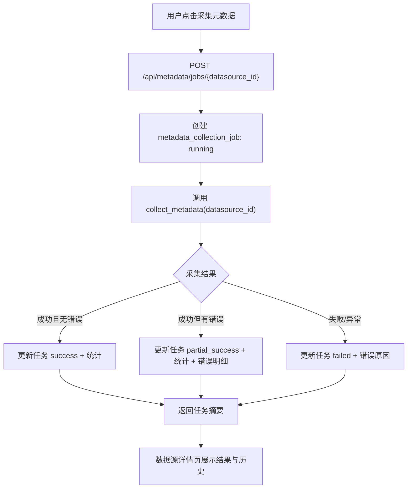

# 元数据采集任务中心设计

## 目标

把当前“点击数据源详情页按钮后同步采集”的能力升级为首版“元数据采集任务中心”：用户可以从数据源触发采集任务，系统记录任务状态、采集统计、失败原因和历史记录，并在 Web 页面上查看最近任务和任务详情。

## 背景

当前 MetricForge 已具备以下能力：

- 数据源详情页有“采集元数据”按钮。
- 前端直接调用 `POST /api/metadata/collect/{datasource_id}`。
- 后端 `collect_metadata(ds_id)` 会同步执行 Oracle 元数据采集。
- 采集结果会写入表、字段、索引、约束元数据。
- 采集后会检测缺少字段语义的字段并生成 `missing_semantic` 治理待办。
- 字段语义治理编辑器已经能从待办补充字段语义并关闭对应语义待办。

当前缺口：

- 没有采集任务记录。
- 没有采集历史。
- 页面刷新后无法追溯上一次采集成功或失败原因。
- 采集按钮只展示即时反馈，不适合长耗时采集。
- 无法区分“采集中、成功、失败、部分失败”等任务状态。

## 范围

本轮覆盖：

- 新增元数据采集任务模型。
- 新增采集任务 API。
- 触发采集时创建任务记录。
- 采集完成后记录状态、统计信息、错误摘要和耗时。
- 数据源详情页展示最近采集任务。
- 新增采集任务列表页或任务中心入口。
- 元数据空状态继续引导用户去数据源触发采集。
- 保留现有采集服务 `collect_metadata()` 的核心逻辑。
- 增加自动化测试覆盖任务创建、成功记录、失败记录和 Web 展示。

本轮不覆盖：

- 真正后台队列。
- 跨进程任务调度。
- WebSocket / SSE 实时进度推送。
- 定时采集。
- schema/table 范围选择。
- 采集取消。
- 重试策略。
- 字段画像采集增强。
- 多数据源并发调度。

## 方案选择

### 方案 A：同步采集 + 任务记录

用户点击采集后，后端创建 `metadata_collection_job`，同步执行 `collect_metadata()`，执行完成后更新任务状态和统计信息。页面展示任务结果和历史。

优点：

- 改动最小。
- 不引入队列或后台 worker。
- 适合当前 SQLite + FastAPI + Jinja 阶段。
- 可以快速补齐历史、失败追踪和 UI 可见性。

缺点：

- 请求仍会等待采集结束。
- 长耗时采集时浏览器仍可能等待较久。

### 方案 B：线程内后台任务

使用 FastAPI `BackgroundTasks` 或本地线程创建任务后立即返回 job id，后台执行采集。

优点：

- 用户不需要等待请求完成。
- 更接近真正任务中心体验。

缺点：

- SQLite、进程重启、异常恢复和并发控制会更复杂。
- 任务状态可靠性有限。
- 当前阶段容易引入不可观测的后台失败。

### 方案 C：正式任务队列

引入 Celery / RQ / APScheduler 等任务系统，采集任务完全异步执行。

优点：

- 长期架构更完整。
- 支持重试、定时、并发、分布式执行。

缺点：

- 需要新增依赖和运行组件。
- 超出当前单机开发阶段。
- 会把本轮从“任务中心”扩成“调度系统”。

## 推荐方案

采用方案 A：同步采集 + 任务记录。

理由：

- 当前最急需的是“可追溯”和“可治理”，不是复杂调度。
- 保留现有 `collect_metadata()` 行为，降低改动风险。
- 任务模型和任务中心 UI 会为下一阶段异步化打好接口基础。
- 后续如果切到后台任务，前端和任务历史页面可以基本复用。

## 数据模型

新增模型：`MetadataCollectionJob`

表名：`metadata_collection_job`

字段：

- `id`: 主键。
- `datasource_id`: 数据源 ID。
- `status`: 任务状态。
  - `running`
  - `success`
  - `failed`
  - `partial_success`
- `triggered_by`: 触发人，首版可为空或默认 `web`。
- `schema_filter`: 本次采集 schema 范围，首版记录文本，暂不提供 UI 选择。
- `started_at`: 开始时间。
- `finished_at`: 结束时间。
- `duration_ms`: 耗时毫秒。
- `tables_count`: 采集表数量。
- `columns_count`: 采集字段数量。
- `indexes_count`: 采集索引数量。
- `constraints_count`: 采集约束数量。
- `error_message`: 整体失败原因。
- `error_details`: schema 或表级错误摘要，文本保存。
- `created_at`: 创建时间。

状态判定：

- `success`: `collect_metadata()` 返回 success 且 `stats.errors` 为空。
- `partial_success`: `collect_metadata()` 返回 success 但 `stats.errors` 非空。
- `failed`: `collect_metadata()` 返回 success false，或触发异常。
- `running`: 任务创建后到采集完成前的状态。首版同步执行中页面不会轮询，但状态仍然有意义。

## API 设计

### 创建并执行采集任务

新增或调整：

`POST /api/metadata/jobs/{datasource_id}`

行为：

1. 校验数据源存在。
2. 创建 `MetadataCollectionJob(status="running")`。
3. 调用 `collect_metadata(datasource_id)`。
4. 根据结果更新任务状态和统计字段。
5. 返回任务摘要。

响应示例：

```json
{
  "id": 12,
  "datasource_id": 2,
  "status": "success",
  "tables_count": 42,
  "columns_count": 580,
  "indexes_count": 73,
  "constraints_count": 91,
  "duration_ms": 18420,
  "error_message": null
}
```

兼容策略：

- 保留现有 `POST /api/metadata/collect/{datasource_id}`。
- 旧接口可以内部调用任务服务并返回兼容的 `message` 和 `stats`。
- 新 UI 优先调用 `/api/metadata/jobs/{datasource_id}`。

### 查询采集任务列表

新增：

`GET /api/metadata/jobs`

Query 参数：

- `datasource_id`: 可选。
- `status`: 可选。
- `limit`: 默认 20，最大 100。

返回按 `started_at desc` 排序的任务摘要。

### 查询采集任务详情

新增：

`GET /api/metadata/jobs/{job_id}`

返回任务完整信息，包括 `error_details`。

## Web 设计

### 数据源详情页

当前页面保留“采集元数据”按钮，但交互改为：

- 点击按钮调用 `POST /api/metadata/jobs/{ds_id}`。
- 按钮显示 `采集中...`。
- 返回后显示任务状态：
  - 成功：`采集成功：X 张表，Y 个字段`
  - 部分成功：`部分成功：X 张表，Y 个字段，N 个错误`
  - 失败：`采集失败：错误摘要`
- 成功或部分成功后刷新页面的已采集表列表。

页面新增“采集历史”区域：

- 展示最近 5 条任务。
- 列包含：
  - 状态
  - 开始时间
  - 耗时
  - 表数
  - 字段数
  - 错误摘要
- 每条任务可进入详情页或展开错误详情。首版可先用详情链接。

### 采集任务中心页面

新增 Web 页面：

`/web/metadata/jobs`

页面内容：

- 筛选栏：
  - 数据源
  - 状态
- 任务列表：
  - 任务 ID
  - 数据源名称
  - 状态
  - 开始时间
  - 结束时间
  - 耗时
  - 表数 / 字段数
  - 错误摘要
- 空状态：
  - `暂无采集任务`
  - 提供 `/web/datasources` 入口。

### 任务详情页

新增 Web 页面：

`/web/metadata/jobs/{job_id}`

展示：

- 数据源信息。
- 任务状态。
- 采集统计。
- 起止时间和耗时。
- 错误摘要。
- 错误明细。

首版任务详情只读，不提供重试按钮。重试放到后续阶段。

## 数据流



## 错误处理

- 数据源不存在：返回 404，不创建任务。
- 采集器返回失败：任务状态为 `failed`，记录 `error_message`。
- 采集过程中抛异常：任务状态为 `failed`，记录异常摘要。
- 单个 schema 失败但整体继续：任务状态为 `partial_success`，记录 `error_details`。
- 任务记录更新失败：API 返回 500；采集结果不应伪装成功。
- 页面展示错误时只显示摘要，详情页展示完整明细。

## 与现有功能的关系

- `collect_metadata()` 继续负责实际采集和语义缺失待办检测。
- 新任务服务只负责包裹采集过程、记录任务状态和统计。
- 数据源详情页从“即时采集反馈”升级为“任务反馈 + 历史”。
- 字段语义治理闭环不改动；采集完成后仍由现有逻辑创建语义缺失待办。

## 测试策略

新增自动化测试：

- 创建采集任务成功时写入 `metadata_collection_job`。
- 采集成功时任务状态为 `success`，统计字段正确。
- 采集返回 `stats.errors` 时任务状态为 `partial_success`。
- 采集失败时任务状态为 `failed`，错误摘要落库。
- 旧 `/api/metadata/collect/{datasource_id}` 仍兼容。
- 数据源详情页包含采集历史区域。
- 采集任务中心页面能展示任务列表。
- 采集任务详情页能展示错误明细。

测试实现建议：

- 对采集 API 层测试可 monkeypatch `collect_metadata()`，避免真实 Oracle 连接。
- Web 页面测试使用 SQLite 临时数据构造任务记录。
- 保留现有全量测试作为回归验证。

## 验收标准

- 用户能从数据源详情页触发采集任务。
- 每次触发都会生成任务记录。
- 成功、部分成功、失败都能在任务历史中追溯。
- 数据源详情页能看到最近采集历史。
- `/web/metadata/jobs` 能查看全局采集任务。
- `/web/metadata/jobs/{job_id}` 能查看任务详情和错误明细。
- 旧采集 API 仍可用。
- 全量测试通过。

## 后续演进

本轮完成后，下一阶段可以在不重写 UI 的前提下继续演进：

- 将任务执行切换为 FastAPI BackgroundTasks。
- 增加任务轮询和进度刷新。
- 增加 schema/table 范围选择。
- 增加失败重试。
- 增加定时采集。
- 增加字段画像采集任务。
